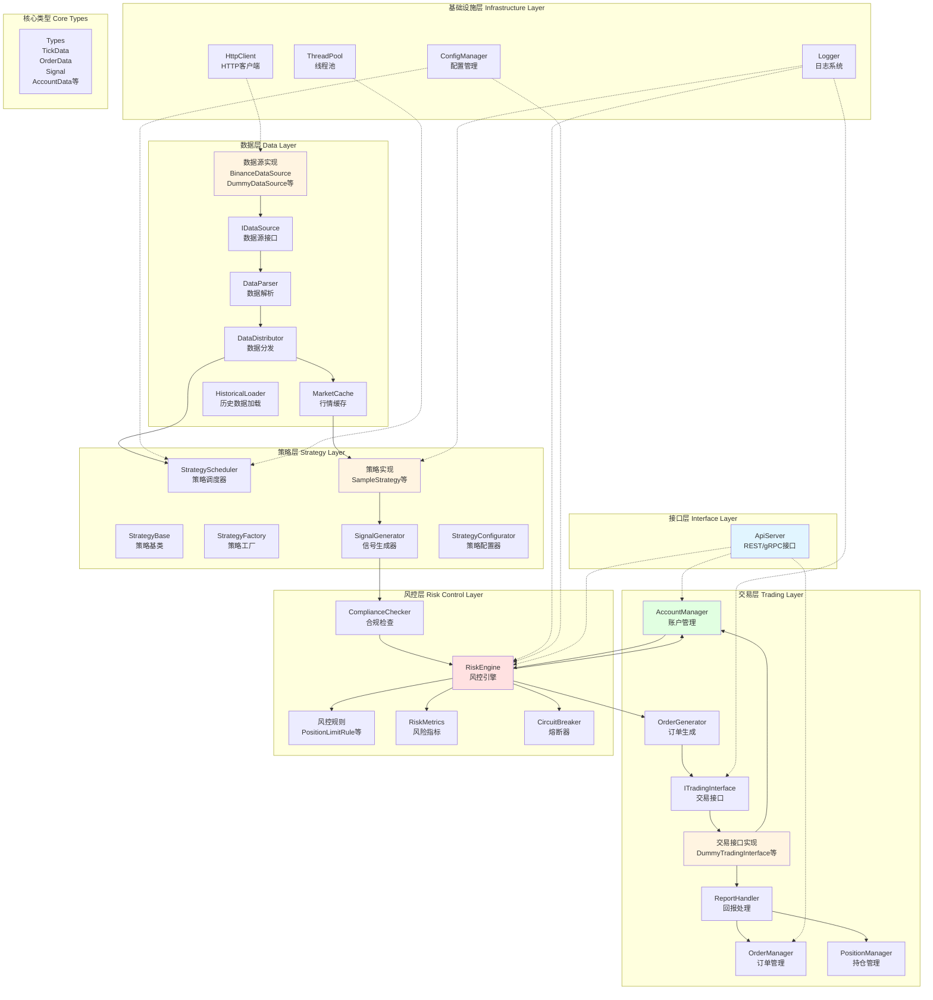
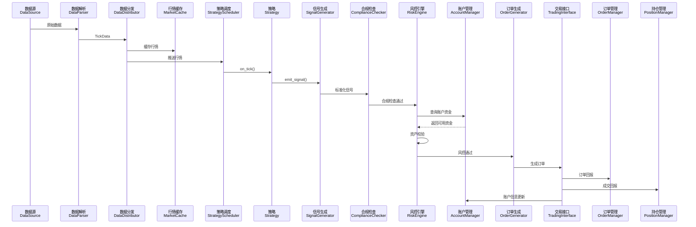
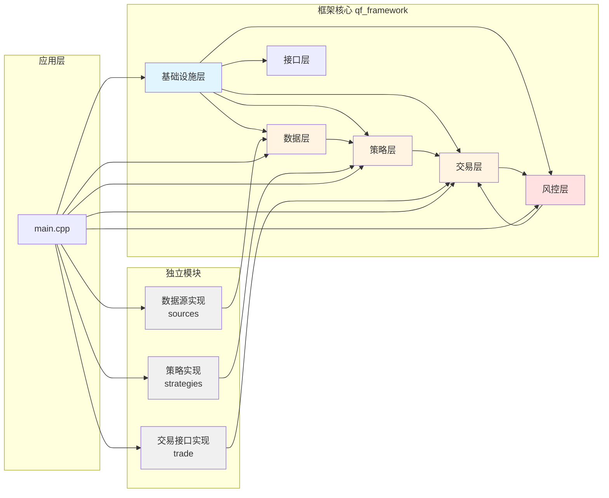

# 量化交易框架架构图

## 整体架构分层图



## 数据流程图



## 模块依赖关系图



## 目录结构图

```
quant_framework/
├── include/
│   ├── qf/                    # 框架核心头文件
│   │   ├── core/              # 核心类型定义
│   │   │   └── types.hpp      # TickData, OrderData, Signal, AccountData等
│   │   ├── infrastructure/    # 基础设施层
│   │   │   ├── logger.hpp     # 日志系统
│   │   │   ├── config.hpp     # 配置管理
│   │   │   └── thread_pool.hpp # 线程池
│   │   ├── common/            # 通用组件
│   │   │   └── http_client.hpp # HTTP客户端
│   │   ├── data/              # 数据层
│   │   │   ├── data_source.hpp
│   │   │   ├── data_parser.hpp
│   │   │   ├── data_distributor.hpp
│   │   │   ├── market_cache.hpp
│   │   │   └── historical_loader.hpp
│   │   ├── strategy/          # 策略层
│   │   │   ├── strategy_base.hpp
│   │   │   ├── strategy_factory.hpp
│   │   │   ├── strategy_scheduler.hpp
│   │   │   ├── signal_generator.hpp
│   │   │   └── strategy_configurator.hpp
│   │   ├── trading/           # 交易层
│   │   │   ├── trading_interface.hpp
│   │   │   ├── order_manager.hpp
│   │   │   ├── position_manager.hpp
│   │   │   ├── account_manager.hpp
│   │   │   ├── order_generator.hpp
│   │   │   └── report_handler.hpp
│   │   ├── risk/              # 风控层
│   │   │   ├── risk_engine.hpp
│   │   │   ├── risk_metrics.hpp
│   │   │   ├── circuit_breaker.hpp
│   │   │   └── compliance_checker.hpp
│   │   └── interface/         # 接口层
│   │       └── api_server.hpp
│   ├── sources/               # 数据源实现（独立）
│   │   ├── dummy_data_source.hpp
│   │   └── binance_data_source.hpp
│   ├── strategies/            # 策略实现（独立）
│   │   └── sample_strategy.hpp
│   └── trade/                 # 交易接口实现（独立）
│       └── dummy_trading_interface.hpp
├── src/
│   ├── qf/                    # 框架核心实现
│   │   └── [对应include/qf的结构]
│   ├── sources/               # 数据源实现
│   ├── strategies/            # 策略实现
│   └── trade/                 # 交易接口实现
├── config/
│   └── config.yaml            # 配置文件
└── src/
    └── main.cpp               # 主程序入口
```

## 关键设计模式

1. **适配器模式**：`IDataSource`、`ITradingInterface` 提供统一接口，不同实现通过适配器接入
2. **观察者模式**：`DataDistributor` 支持订阅/发布行情数据
3. **工厂模式**：`StrategyFactory` 负责策略实例创建
4. **策略模式**：`RiskRule` 接口支持多种风控规则
5. **单例模式**：`Logger`、`StrategyFactory` 使用单例

## 数据流向说明

1. **行情数据流**：数据源 → 解析器 → 分发器 → 缓存/策略
2. **交易信号流**：策略 → 信号生成 → 合规检查 → 风控校验 → 订单生成 → 交易接口
3. **回报数据流**：交易接口 → 回报处理 → 订单管理/持仓管理/账户管理
4. **账户同步流**：交易接口 → 账户管理 → 风控引擎（用于资产校验）

